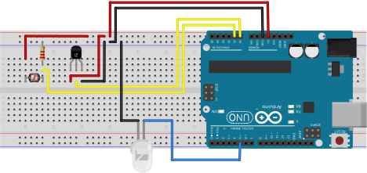

# Megamind, Arduino Firmware
Brincadeira de horas vagas...

### Modelo: 

### Componentes:
* Sensor LDR (Luminosidade)
* Sensor LM35 (Temperatura ambiente)
* LED de alto brilho ~5V

### Objetivo
Receber comandos via porta serial e executar o comando e enviar respostas equivalentes pela porta seria em formato JSON

